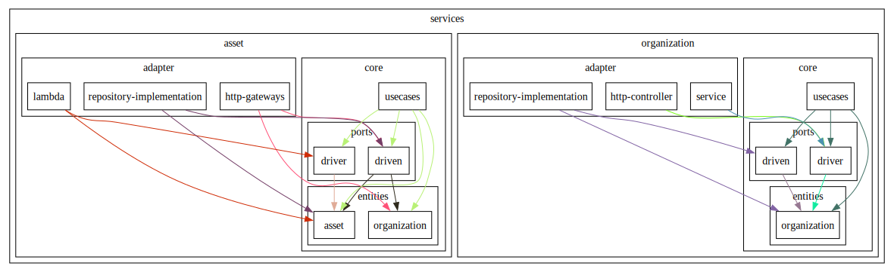

## Scenario
The system knows Assets, Devices, Organizations and Components.  
An Asset can be a Motor, a Controller, or the Casing.  
New Types of assets will be added in the future.  
The Consumer will work the more concrete concepts. Like Motor or Casing.  
The Term Asset is a more abstract/internal concept.
Devices are monitoring Devices for IoT Analytics.


Assets have their own lifecycle.   
An Asset can be assigned to an Organization.   
An Asset has at least one and at max infinite Devices attached to it.   
Devices **do not** have their own lifecycle.   
A Component is a part of a Device, it is only named but does not have its own lifecycle.   
A Component can be assigned to a Device to indicate where the device is mounted on the Asset (e.g. A sensor **device** on a motor **asset**).


Organizations have their own lifecycle.


## run ADD NEW MOTOR USECASE:
```bash
yarn ts-node app-cli/myAppName/app-cli-add-motor.ts  
```

## run ASSIGN ORGA USECASE:
```bash
yarn ts-node app-cli/myAppName/app-cli-assign-orga.ts  
```

## cleanup local files:
```bash
yarn cleanup
```

## test service setup:
```bash
yarn test
```

## dependency graph:
! need `dot` (graphviz) to be installed on your machine

```bash
yarn create-dependency-graph
```
output will be in `./dependency-graph.svg`

